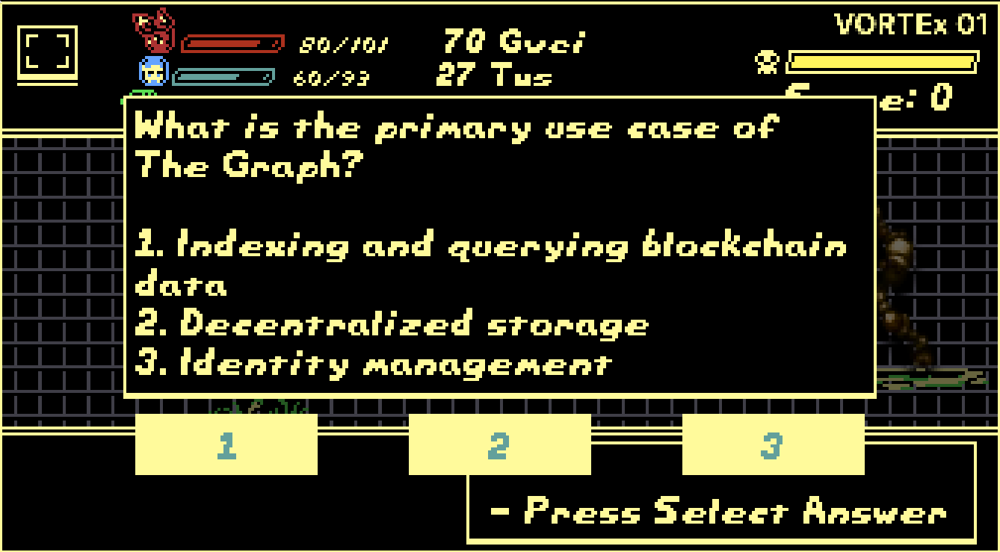

# SphereQuizGame

[Play the demo](https://sphere-quiz.vercel.app/)

**[User Flow] Very simple!!**

0. 🎁 New Round（Chest key is decided by randomness）

-- Main part

1. 😎 User Start Game
2. 👛 Connect wallet to Scroll and Load playar character parameter (Hp,Attack)
3. 🎓 Proceed through stages (Quiz/Sphere)
4. ⚡️ Beet the boss
5. 🔑 Mint your NFT key

--- Go back to 1.

6. 🎉 (if you are lucky), you can open Eth Treasure Chest 🎁 by ur keys 🔑
7. 🏯 (if someone succesfully opne box), all of key are burn and start new round.

## Sound

https://www.sound.xyz/samnogg/game-odyssea

## Summary

SphereQuizGame innovatively combines off-chain and on-chain elements, offering a unique gaming experience where characters' strength is influenced by players' Scroll Mainnet activity and ETH holdings. The game features quizzes, sphere-matching for HP recovery, and NFT keys for opening treasure chests. As players progress, enemy strength increases based on collected ETH. SphereQuizGame exemplifies crypto gamification, providing an immersive experience that showcases the allure of cryptocurrency.



## QuizSet

- Please Proposal from [here](https://forms.gle/AUJ8YaX9wsexi8ie7).

# What Onchain/Offcahin?

In the off-chain game, players use three fixed characters to battle enemies while answering quizzes. One of the distinctive features of the game is that the strength of the characters varies based on the state of the Scroll Mainnet. Specifically, the attack power of the characters is influenced by factors such as the gas price of the player's latest transaction, the number of transactions in the last 7 days, and the proximity of the latest transaction's block number to the current block number. This mechanism ensures that the player's activity on the Scroll Mainnet is reflected in the game.

Moreover, the characters' HP is determined by the amount of ETH held by the player. Players with a larger amount of ETH can have higher HP, giving them an advantage in progressing through the game.

The off-chain game also includes a sphere-matching part. Players can recover HP by connecting three or more spheres of the same color. This adds a strategic element to the game and increases its depth.

As for the on-chain elements, players can acquire an NFT after clearing the game. The NFT serves as a key, and only players with the corresponding key can open a treasure chest. A key is obtained each time the game is cleared, and the treasure chest contains the ETH collected within the game. Players can increase their chances of opening the treasure chest by repeatedly challenging the game and collecting the corresponding keys. Furthermore, as players progress through the game, the strength of the enemies increases. This is determined by the amount of ETH collected within the game, providing a more challenging gaming experience.

SphereQuizGame is an example of gamification filled with the allure of crypto. It features a unique mechanism where activities on the blockchain directly influence gameplay, and the progress of the game is reflected in the on-chain rewards. This allows players to engage more deeply with the world of crypto and experience its appeal through the game.

## Architecture

- Todo

## Tech Stack

### Ankr

Our Rpc is supported by Ankr's RPCs

https://www.ankr.com/

### Covalent

To fetch the latest transaction for a specific address on the Scroll Mainnet, you can use the getAllTransactionsForAddress method from the TransactionService:

```
let latestTransaction = null;
for await (const resp of client.TransactionService.getAllTransactionsForAddress(
  "scroll-mainnet",
  address,
  { "noLogs": true, "blockSignedAtAsc": false }
)) {
  latestTransaction = resp;
  break;
}
```

https://github.com/ZaK3939/sphere-quiz/blob/main/src/scenes/battle.ts

### The Graph

The retrieved top score is then displayed using the topScoreText object in the game scene.

```
query {
  mintKeyEvents(orderBy: score, orderDirection: desc, first: 1) {
    score
  }
}
```

Code: https://github.com/ZaK3939/sphere-quiz/tree/main/spherequizgamenft
Link: https://api.studio.thegraph.com/query/29168/spherequizgamenft/v0.0.1

## Contract

#### SepoliaScroll

| contract          | contract address                                                                  |
| ----------------- | --------------------------------------------------------------------------------- |
| SphereQuizGameNFT | https://sepolia.scrollscan.com/address/0x82845dfa6d2185547480372eedf213d4c2976da3 |

#### Sepolia

| contract  | contract address                                                                |
| --------- | ------------------------------------------------------------------------------- |
| BossStats | https://sepolia.etherscan.io/address/0xbdc3bd11d25dba5427ef3e7a072cdece99caf001 |

## Ack

- [Phaser](https://phaser.io/)
- [RBG](https://github.com/Osmose/RBG/)

## Feature Works

- QuizData should be private
- Launch to ScrollMainnet

## License

SphereQuizGame is distributed under the [MIT No Attribution license](LICENSE).

## Contact

- https://warpcast.com/zak3939
